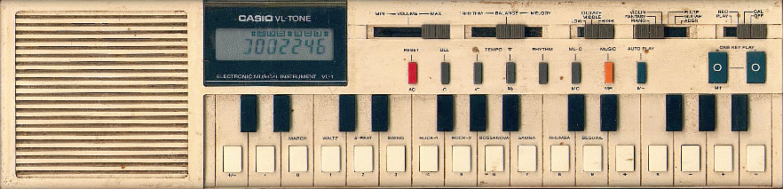

# VL1-emulator

[:point_right: Lire en français :fr:](README.fr.md)

An emulator of Casio VL-Tone VL1, based on source code by PolyValens

[](https://travis-ci.com/linuxmao-org/VL1-emulator)

Home page: http://www.polyvalens.com/blog/vl-1/

The information from the official page may not represent exactly the current state of this fork.



## Downloads

**Development**

- All: download from [Automatic builds](https://github.com/linuxmao-org/VL1-emulator/releases/tag/automatic).

## Build instructions

1. Obtain prerequisites

Install needed packages:

- `git`
- `build-essential`
- `pkg-config`
- `libx11-dev`
- `libcairo2-dev`
- `libjack-jackd2-dev` or `libjack-dev`
- `mesa-common-dev`

2. Check out the repository and submodules

```
git clone https://github.com/linuxmao-org/VL1-emulator.git
cd VL1-emulator
git submodule update --init
```

3. Compile

```
make
```

4. Install

```
sudo make install  # to install in system directories, or
make install-user  # to install in the home directory
```

## Changelog

**v1.1.0.0**

This version is a marker of a new release series, which is a cross-platform
modification of the original VSTi source code.
The functionality is mostly but not exactly identical to the original, and there
remain some minor items to be implemented.

- eliminated an audible click when retriggering a voice
- edited the picture to remove the brand name of the original instrument
- supported automation recording
- added tooltips to facilitate reading
- changed parameter domains to be human-readable
- fixed handling of calculator and ADSR memory, on a locale which uses "," as decimal separator
- immediate handling of MIDI messages, without a buffer
- resolved potential out-of-bound memory accesses
- supported multiple instances in the same host
- supported some new platforms and formats

**v1.0.?.?**

- imported upstream source code
- relicensed to `CC0-1.0 or MIT` by the author PolyValens
